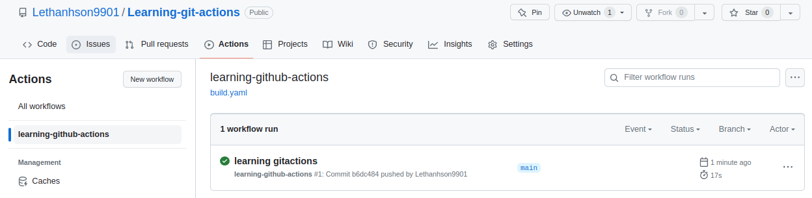

# Learning-git-actions
Learning from Youtube: GitHub Actions Workflow + Docker Build &amp; Push (Beginner Tutorial)
[GitHub Actions Workflow + Docker Build & Push (Demo + Giải Thích)](https://www.youtube.com/watch?v=33Ttv3taz7I&t=1s&ab_channel=FullstacKAGE)

- **Github Actions**
    - là chức năng cho phép chúng ta tạo `workflows` vòng đời phát triển phần mềm cho dự án trực tiếp trên Github repository
    - Với Github Actions chúng ta có thể tích hợp continuous integration (CI) và continuous deployment (CD) trực tiếp trên repository của mình
- **Khởi tạo Workflow - B1: Checkout**
    - Clone flask app đơn giản: https://github.com/p-le/flask-helloworld
    - Github actions workflow mặc định tại đường dẫn: ./github/workflow. Trong đây, ta sẽ tạo file *build.yaml* để khởi tạo workflow.
    
    ```yaml
    name: learning-github-actions
    on:
      push:
        branches: [ main ]
    jobs:
      docker:
        runs-on: ubuntu-latest
        steps:
          - name: Checkout
            uses: actions/checkout@v2
    ```
    
    - Push lên nhánh main github để xem kết quả
        
        
        
        - Khởi tạo thành công workflow có tên là: *learning-github-actions.* Bấm vào workflow này, ta sẽ thấy job *docker*
        
        
        
        - Quan sát thấy, hệ điều hành được sử dụng là *Ubuntu 22.04*
        - Trong step C*heckout*: git repo đã được tải về
- **Bước 2: Tạo Personal Access Token trên Docker Hub**
    - Truy cập vào docker hub ⇒ Account Settings ⇒ Security ⇒ Create Access Token: dckr_pat_ZspMYyLB8Qmbfsvm5fEUYEtr1Wo
        
        
        
    - Quay trở lại github với repo: Learning-github-actions ⇒ Settings ⇒ Secrets and variables ⇒ Actions ⇒ New repository secrets ⇒ Tạo secret là *DOCKERHUB_USERNAME / sonlt173346hust* và *DOCKERHUB_ACCESS_TOKEN / <dockerhub-token>*
        
        
        
    - Quay lại VS Code, config file *build.yaml,* Thêm step với *name* là *Login Docker Hub*
        
        ```yaml
        name: learning-github-actions
        on:
          push:
            branches: [ main ]
        jobs:
          docker:
            runs-on: ubuntu-latest
            steps:
              - name: Checkout
                uses: actions/checkout@v2
              
              - name: Login Docker Hub
                uses: docker/login-action@v1
                with:
                  username: ${{ secrets.DOCKERHUB_USERNAME }}
                  password: ${{ secrets.DOCKERHUB_ACCESS_TOKEN }}
        ```
        
    - Push lên github và xem kết quả (Login thành công
        
        
        
        
        
- **Bước 3,4,5,6 : Setup Docker Buildx, Build và Push Docker Image, Verify**
    - **Setup** **Docker Buildx**: là tiện ích CLI mở rộng Docker command để tăng hiệu năng của Docker command.
        
        ```yaml
        - name: Setup Docker Buildx
        	  uses: docker/setup-buildx-action@v1
        	  id: buildx
        ```
        
        - Thêm id *buildx* sử dụng để bắt output cho các step sau này.
    - **Thêm cache để tối ưu Docker build**
        
        ```yaml
        - name: Cache Docker Image Layers
                uses: actions/cache@v2
                with:
                  path: /tmp/.buildx-cache
                  key: ${{ runner.os }}-buildx-${{ github.sha }}
                  restore-keys: |
                    ${{ runner.os }}-buildx-
        ```
        
    - **Build và Push Docker Image**
        
        ```yaml
        - name: Build and Push Docker Image
        	  uses: docker/build-push-action@v2
        	  id: docker_build
        	  with:
        	    context: ./
        	    file: ./Dockerfile
        	    builder: ${{ steps.buildx.outputs.name }}
        	    push: true
        	    tags: ${{ secrets.DOCKERHUB_USERNAME }}/learning-git-actions
        	    cache-from: type=local,src=/tmp/.buildx-cache
        	    cache-to: type=local,dest=/tmp/.buildx-cache
        ```
        
    - **Verify**
        
        ```yaml
        - name: Verify
        	  run: echo ${{ steps.docker_build.outputs.digest }}
        ```
        
    - Cùng xem kết quả:
        
        
        
        
        
        
        
        ⇒ Đóng gói docker và đẩy lên dockerhub thành công